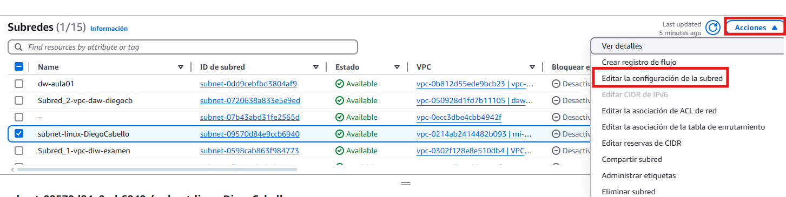
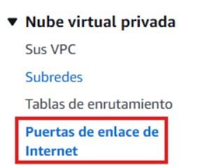
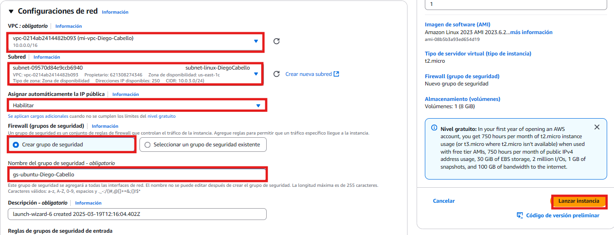

# aws-examen-web-Diego-CabelloBautista
## Paso 1: Crear una VPC en AWS

```bash
Primero cuando entramos accederemos a VPC.
```

```bash
En el menu que tendremos en la parte media a la izquierda de la pantalla iremos a Sus VPC.
```


```bash
Crearemos una.
```


```bash
Pondremos nombre y con la CIRD IPv4.
```

```bash
En el menu que nos aparcia a la izquierda iremos a subredes.
```

```bash
Crearemos una subred.
```


```bash
Asociamos la subred que queramos crear a la VPC que hayamos creado anteriormente.
```

```bash
Ponemos nombre a la subred, y le añadimos la ip a el bloque de CIDR de la subred.
```


```bash
Realizaremos lo mismo pero con la subred numero 2.
```


```bash
Una vez creadas les habilitaremos la opcion de asignar automaticamente la direccion IPv4.
```

```bash
Marcaremos esta opcion.
```

```bash
A continuacion crearemos una puerta de enlace de internet(gateway).
```

```bash
Le asignamos el nombre a la puerta de enlace de internet.
```


```bash
Cuando creemos la gateway, nos saldra un mensaje en verde y deberemos de darle para asociarle la vpc.
```

```bash
Le asignamos la vpc que hayamos creado a el principio.
```

```bash
Por ultimo en la seccion de VPC tendremos que crear una tabla de enrutamiento.
```

```bash
Una vez creada, nos iremos a ruta, editar ruta.
```

```bash
Añadimos la direccion 0.0.0.0, Puerta de enlace de internet, y la seleccionamos la gateway que hayamos creado.
```

```bash
Tambien tendremos que asociarle las subredes que hemos creado anteriormente.
```

```bash
Ya habremos acabado la parte de VPC, tendremos que acceder a EC2.
```


```bash
Iremos a Instancias.
```


```bash
Lanzaremos una instancia.
```


```bash
Primero crearemos la de windows,le asignamos el nombre, y con la ISO 2022 Base.
```


```bash
Le asignamos un par de claves.
```


```bash
Le tendremos que añadir el tipo de instancia t3.medium
```


```bash
En la configuracion de red, la editaremos, le asignamos la vpc, la subred que hayamos creado para ubuntu y el grupo de seguridad.
```


```bash
Le añadimos las reglas de seguridad de entrada.
```


```bash
Y tambien las de salida.
```


```bash
Crearemos una más que sera la de Ubuntu, le asignamos el nombre, la ISO.
```

```bash
Le asignamos el par de claves y el tipo de instancia.
```

```bash
En la configuracion de red, la editaremos, le asignamos la vpc que hayamos creado, la subred de linux, y creamos el grupo de seguirdad.
```


```bash
Le configuramos las reglas de entrada.
```


```bash
Y tambien las de salida.
```

```bash
Ya tendremos que conectarnos a la maquina virtual, seleccionaremos la maquina virtual, le daremos a conectar y en el apartado de cliente de ssh
```


```bash
Una vez dentro tendremos que ejecutar los siguientes comandos
```


## Pull request

```bash
Para que mi compañero pueda realizarme un pull request tendre que crear un .txt por ejemplo.
```


```bash
Le añadimos un commit para guardarlo.
```


```bash
Realizaremos un git push origin andres, para subirlo a GitHub y que mi compañero pueda hacerme el Pull Request.
```


```bash
Una vez que hayamos echo lo anterior, tendremos que agregarlo colaboradores, y el a nosotros, cuando nos agregue acceptaremos la solicitud, iremos a su GitHub, y en el apartado de arriba seleccionaremos Pull Request y Create Pull Request.
```


```bash
Le ponemos un titulo y una descripcion.
```


```bash
Ya habriamos realizado el Pull request como podemos comprobar.
```


